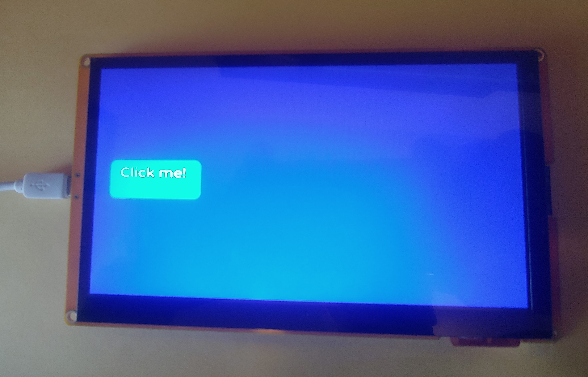
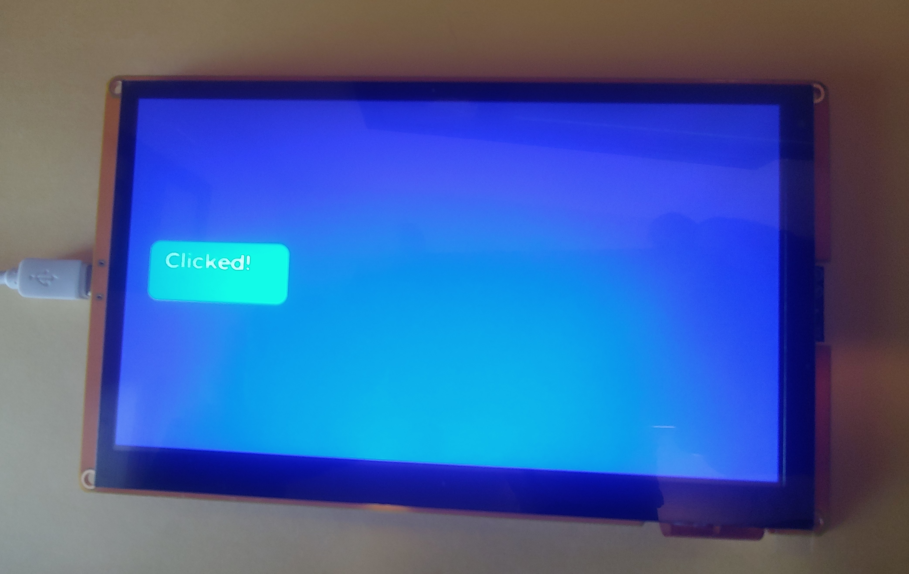

# Rust ESP32S3 Lvgl Clickme

The purpose of this demo is to get lv-binding-rust (Lvgl) running on the ESP32S3 development board and to use the touchscreen.

## Development Board
Aliexpress ESP32-8048S070 - 7 inch 800x400 TN RGB with ESP32S3, 8M PSRAM, 16M Flash, 512KB SRAM

## Overview
This application shows how to use lv-binding-rust crate on a ESP32S3 device along with the touchscreen.  The program will display a large button that shows "Click me!".  When the user clicks the button the button will now show "Clicked!"


## partition-table folder
The partition-table folder contains a file called partitons.csv.  This file increases the default factory/app partiton from the default of 1M to 3M. This allows us more space for our program and since the flash size is 16M this should not be a problem.  This file will be called when we flash the device.

## custom-fonts folder
I left the custom-fonts folder in the project but currenly I am not using a custom but but instead using the LV_FONT_MONTSERRAT_28 enabled in the lv_conf.h file.
I also made the LV_FONT_MONTSERRAT_28 as the LV_FONT_DEFAULT.
The custom-fonts folder contains our custom fonts.  The customs fonts are converted from TTF fonts using lvgl online font converter at https://lvgl.io/tools/fontconverter.  I used https://ttfonts.net to find a font I liked and then downloaded the font.  In the lvgl-online-font-converter I used the font name plus the font size for the name of the font.  I chose Bpp of 2 bit-per-pixel and set the range of 0x30-0x3A since I only need numbers and the ":" character.  After clicking on "Convert" the file will be downloaded. I placed this downloaded file (*.c) into the custom-fonts folder.  Then I created a header file which has an extern to my *.c file, along with changing the ifndef and define names.
To use this custom font, I added ```LVGL_FONTS_DIR = {relative = true, value = "custom-fonts"}``` to my config.toml under [env].  This allows our font to be compiled when lvgl is compiled.

## lvgl-configs folder
The lvgl-configs folder holds the lv_config.h and lv_drv_conf.h files which are required by lvgl to compile.  Everything in lv_drv_conf.h file is set to 0 as I am not using the lvgl drivers.  I the only thing I changed in the lv_conf.h file was I added additional font (LV_FONT_MONTSERRAT_28) and changed the default font (LV_FONT_DEFAULT &lv_font_montserrat_28).

## lcd_panel.rs file
The LCD RGB panel driver.

## gt911.rs file
The GT911 touchscreen controller driver.

## sdkconfig.defaults file
The following needs to be added for using PSRAM.
```
CONFIG_SPIRAM=y
CONFIG_SPIRAM_MODE_OCT=y
CONFIG_SPIRAM_SPEED_80M=y

# Enabling the following configurations can help increase the PCLK frequency in the case when
# the Frame Buffer is allocated from the PSRAM and fetched by EDMA
CONFIG_SPIRAM_FETCH_INSTRUCTIONS=y
CONFIG_SPIRAM_RODATA=y
```

## Cargo.toml project file
I added the following to the "dependencies" section.
```
esp-idf-hal = { version = "0.42.5" }
esp-idf-sys = { version = "0.33.7"}

cstr_core = "0.2.1"
embedded-graphics-core = "0.4.0"

lvgl = { version = "0.6.2", default-features = false, features = [
    "embedded_graphics",
    "unsafe_no_autoinit",
] }

lvgl-sys = { version = "0.6.2" }

embedded-hal = {version = "1.0.0-rc.1"}

anyhow = "1.0"

```

I also included patch.crates-io section to patch esp-idf-sys, lvgl and lvgl-sys
```
[patch.crates-io]
esp-idf-sys = { git = "https://github.com/esp-rs/esp-idf-sys"}
lvgl = { git = "https://github.com/enelson1001/lv_binding_rust"}
lvgl-sys = { git = "https://github.com/enelson1001/lv_binding_rust"}

```

## config.toml
To get lv-bindings-rust to comple and build I made the following changes to the config.toml file.
```
[build]
target = "xtensa-esp32s3-espidf"

[target.xtensa-esp32s3-espidf]
linker = "ldproxy"
# runner = "espflash --monitor" # Select this runner for espflash v1.x.x
runner = "espflash flash --monitor" # Select this runner for espflash v2.x.x
rustflags = [
    # Extending time_t for ESP IDF 5: https://github.com/esp-rs/rust/issues/110
    "--cfg",
    "espidf_time64",
]
[unstable]
build-std = ["std", "panic_abort"]

[env]
MCU="esp32s3"
# Note: this variable is not used by the pio builder (`cargo build --features pio`)
ESP_IDF_VERSION = "v5.2.2"

# The directory that has the lvgl config files - lv_conf.h, lv_drv_conf.h
DEP_LV_CONFIG_PATH = { relative = true, value = "lvgl-configs" }

# Required to make lvgl build correctly otherwise get wrong file type
CROSS_COMPILE = "xtensa-esp32-elf"

# Required for lvgl otherwise the build would fail with the error -> dangerous relocation: call8: call target out of range
# for some lvgl functions
CFLAGS_xtensa_esp32s3_espidf="-mlongcalls"

# Directory for custom fonts (written in C) that Lvgl can use
LVGL_FONTS_DIR = {relative = true, value = "custom-fonts"}

# If you are getting string.h NOT FOUND try including this.  Edit for your correct path.
#C_INCLUDE_PATH = "/home/runner/.rustup/toolchains/esp/xtensa-esp-elf/esp-13.2.0_20230928/xtensa-esp-elf/xtensa-esp-elf/include"
```
## string.h Not Found
If you are getting string.h not found try uncommenting the last entry in config.toml.

## lv-binding-rust fork
I updated my fork of lv-binding-rust to include PR153 ie the changes recommended by madwizard-thomas.

## Flashing the ESP32S3 device
I used the following command to flash the ESP32S3 device.
```
$ cargo espflash flash --partition-table=partition-table/partitions.csv --monitor
```

## Picture of Aliexpress ESP32S3 running the demo
The picture quality is pretty poor but you get the idea what you should be seeing.

The click me


The clicked



# Versions
### v1.0 :
- initial release
